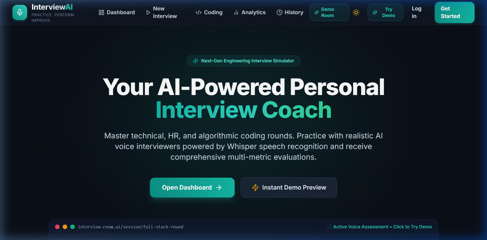
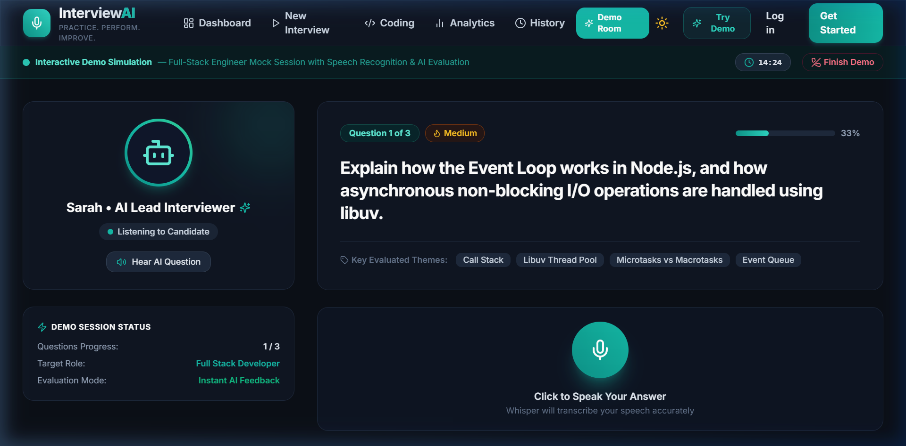
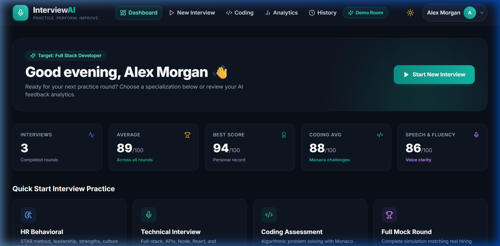
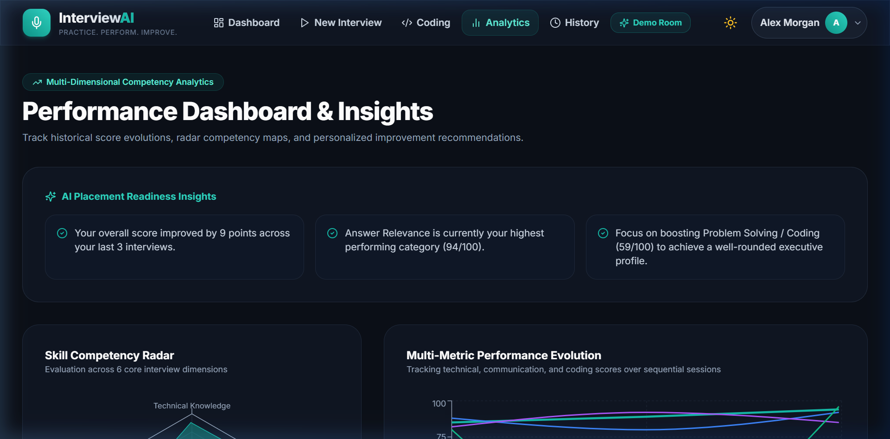
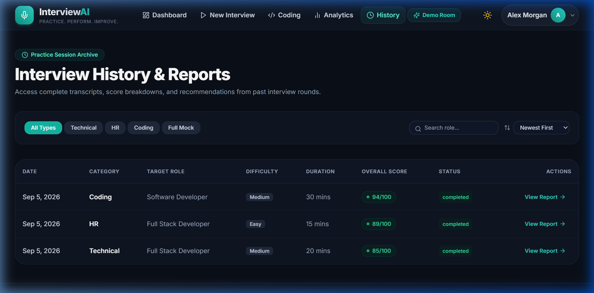

<div align="center">

# 🎙️ InterviewAI – AI-Powered Personal Interview Coach
### *“Practice. Perform. Improve.”*

[](https://interview-ai-unnati.netlify.app)
[](LICENSE)
[](https://github.com/UnnatiJain09/interview-ai/actions)

[](https://reactjs.org/)
[](https://nodejs.org/)
[](https://expressjs.com/)
[](https://www.mongodb.com/)
[](https://tailwindcss.com/)
[](https://openai.com/)

**An end-to-end full-stack, Generative AI interview simulation platform engineered for software engineering placement prep, technical interviews, coding assessments, and HR behavioral rounds.**

[🚀 View Live Deployment](https://interview-ai-unnati.netlify.app) • [📖 Documentation](#-table-of-contents) • [📸 UI Gallery](#-user-interface-showcase) • [💡 How It Works](#-how-interviewai-works) • [🐛 Report Bug](https://github.com/UnnatiJain09/interview-ai/issues)

</div>

---

## 📑 Table of Contents
1. [🌟 What is InterviewAI?](#-what-is-interviewai)
2. [📸 User Interface Showcase](#-user-interface-showcase)
3. [⚙️ How InterviewAI Works](#-how-interviewai-works)
4. [✨ Key Features Breakdown](#-key-features-breakdown)
5. [🏗️ System Architecture & Data Flow](#-system-architecture--data-flow)
6. [💻 Technology Stack](#-technology-stack)
7. [🗄️ Database Models (Mongoose)](#-database-models-mongoose)
8. [🌐 REST API Endpoints](#-rest-api-endpoints)
9. [🎯 8-Dimensional AI Evaluation Rubric](#-8-dimensional-ai-evaluation-rubric)
10. [🚀 Local Setup & Installation](#-local-setup--installation)
11. [📁 Project Structure](#-project-structure)
12. [👩‍💻 Author & Project Info](#-author--project-info)

---

## 🌟 What is InterviewAI?

**InterviewAI** is an intelligent full-stack mock interview and evaluation web platform built as an individual **Final-Year B.Tech Information Technology Capstone Project**.

### 🎯 The Problem
* **Traditional Mock Interviews** with human mentors are expensive ($50–$150/hr), hard to schedule, and subjective.
* **Static Question Banks** (e.g. LeetCode questions or flashcards) fail to simulate the real-time pressure, verbal communication hurdles, and unexpected follow-up inquiries that happen in real interview rooms.
* **Basic Chatbots** give generic, text-only answers without audio playback, speech recognition, code compilation, or multi-dimensional scoring rubrics.

### 💡 The Solution: InterviewAI
InterviewAI replicates a real human hiring manager through a **voice-driven, context-aware simulation**:
- 🎙️ **Microphone Speech Recognition**: Candidates speak naturally into their mic, and OpenAI Whisper STT transcribes the speech into high-precision transcripts.
- 🔊 **Voice Audio Delivery**: The AI interviewer greets the candidate and speaks interview questions aloud with realistic text-to-speech audio synthesis.
- 🧠 **Context-Aware Dynamic Probing**: The AI actively listens to what the candidate said and dynamically asks follow-up questions to test depth of knowledge.
- 💻 **Monaco Code Sandbox**: Built-in algorithmic IDE (VS Code engine) allowing candidates to write and execute code against test cases in real-time.
- 📊 **8-Dimensional Scoring & Analytics**: Scores every answer across Technical Depth, Relevance, Accuracy, Completeness, Structure, Communication, Fluency, and Grammar.

---

## 📸 User Interface Showcase

### 1. Landing Page & Hero Section
*Modern, glassmorphic landing page with instant demo access, specialization pathways, and interactive hero previews.*



---

### 2. Interactive AI Interview Simulator Room
*Simulated interview room featuring live question prompts, AI interviewer avatar with audio playback, microphone speech transcription, timer, and theme evaluation tags.*



---

### 3. Candidate Analytics & Progress Dashboard
*Comprehensive candidate overview with 5 core statistics cards, performance area charts, quick-start interview launchers, and historical session logs.*



---

### 4. Competency Radar & Multi-Metric Performance Insights
*Interactive Recharts Radar graphs evaluating candidate performance across 6 engineering pillars: System Architecture, Problem Solving, Clean Code, Communication, Behavioral Fit, and Edge Cases.*



---

### 5. Historical Sessions Archive & Detailed Scorecards
*Searchable and filterable interview log archive with difficulty classification, timestamps, score badges, and direct links to comprehensive post-round reports.*



---

## ⚙️ How InterviewAI Works

```
 ┌──────────────────────┐        ┌──────────────────────┐        ┌──────────────────────┐
 │  1. Configure Round  │  ───▶  │ 2. Spoken / Code Ans │  ───▶  │ 3. Whisper STT Audio │
 │  Category, Role, Lvl │        │ Mic or Monaco Editor │        │ Live Speech Capture  │
 └──────────────────────┘        └──────────────────────┘        └──────────────────────┘
                                                                             │
                                                                             ▼
 ┌──────────────────────┐        ┌──────────────────────┐        ┌──────────────────────┐
 │  6. Radar Scorecard  │  ◀───  │ 5. Dynamic Follow-Up │  ◀───  │ 4. 8-Metric AI Eval  │
 │ Longitudinal Insight │        │ Context-Aware Probing│        │ Structured Scoring   │
 └──────────────────────┘        └──────────────────────┘        └──────────────────────┘
```

### Step 1: Interview Setup & Customization
The candidate selects an interview category (**Technical**, **HR Behavioral**, **Coding Assessment**, or **Full Mock**), target role (e.g. *Full Stack Developer, Backend Engineer, Frontend Specialist*), difficulty level (*Easy, Medium, Hard*), duration, and question count.

### Step 2: Realistic AI Interview Room
* The AI interviewer introduces the round and presents the first question with audio speech synthesis.
* The candidate activates their microphone and speaks their answer naturally or writes code in the Monaco IDE.

### Step 3: Speech Transcription (Whisper STT)
* Spoken audio recorded via HTML5 `MediaRecorder` is processed through the **OpenAI Whisper API (`whisper-1`)** with a zero-friction fallback to browser Web Speech Recognition for guaranteed offline functionality.

### Step 4: 8-Dimensional Multi-Metric Scoring
* The backend AI engine analyzes the candidate's transcript across 8 distinct criteria:
  1. **Technical Knowledge**: Mastery of foundational and advanced concepts.
  2. **Relevance**: Direct focus on the question asked.
  3. **Accuracy**: Factually correct explanations.
  4. **Completeness**: Addressing edge cases and trade-offs.
  5. **Communication**: Articulation and logical flow.
  6. **Clarity**: Conciseness without unnecessary filler.
  7. **Structure**: Effective use of the STAR method or structured reasoning.
  8. **Grammar & Fluency**: Professional phrasing and vocabulary.

### Step 5: Adaptive Contextual Follow-Up
* If the candidate mentions an interesting trade-off or misses an architectural consideration, the AI interviewer dynamically crafts a contextual follow-up question to probe deeper (e.g., *"You mentioned using Redis for caching; how would you handle cache invalidation during high traffic spikes?"*).

### Step 6: Post-Interview Scorecard & Longitudinal Analytics
* Candidates receive an in-depth scorecard displaying question-by-question candidate transcript vs. **Model Ideal Answer**, strengths, weaknesses, Recharts competency radars, and celebration confetti.

---

## ✨ Key Features Breakdown

| Feature | Description |
| :--- | :--- |
| 🎯 **4 Specialized Interview Modes** | • **Technical Round**: Tailored to full-stack, frontend, backend, devops, and databases.<br>• **HR Behavioral**: Evaluates STAR method, leadership, communication, and fit.<br>• **Coding Assessment**: Monaco code editor with live test-case runner.<br>• **Full Mock Round**: Comprehensive end-to-end multi-stage simulation. |
| 🎙️ **Voice & Audio Pipeline** | Dual-engine STT (OpenAI Whisper + Web Speech API) and realistic interviewer voice synthesis. |
| 💻 **Monaco Code Sandbox** | Syntax-highlighted code editor supporting JavaScript, Python, Java, and C++ with execution time measurement (ms). |
| 📊 **Actionable AI Feedback** | Detailed question reviews comparing candidate answers against model ideal answers with specific improvement suggestions. |
| 📈 **Longitudinal Analytics** | 6-pillar Radar competency charts and progression timelines tracking growth across multiple practice sessions. |
| 🌓 **Bespoke UI/UX & Theming** | Persistent dark/light mode, glowing accents, and glassmorphic panels. |
| ⚡ **Instant Demo Mode** | Pre-seeded with demo account (`demo@interviewai.com`) and completed interview records for immediate evaluator testing. |

---

## 🏗️ System Architecture & Data Flow

```
                             ┌───────────────────────────────────┐
                             │       InterviewAI Web Client      │
                             │   React 18 • Vite • Tailwind CSS  │
                             │     Monaco Editor • Recharts      │
                             └─────────────────┬─────────────────┘
                                               │
                                 HTTPS / REST  │  Multipart Audio
                                               ▼
                             ┌───────────────────────────────────┐
                             │     Node.js / Express Backend     │
                             │  JWT Middleware • Multer • CORS   │
                             └─────┬───────────┬───────────┬─────┘
                                   │           │           │
         ┌─────────────────────────┘           │           └─────────────────────────┐
         ▼                                     ▼                                     ▼
┌──────────────────┐               ┌───────────────────────┐             ┌───────────────────────┐
│  MongoDB Atlas   │               │   AI & Speech Engine  │             │   Sandboxed Runner    │
│ Mongoose Schemas │               │ OpenAI GPT-4o Whisper │             │ Child-Process Sandbox │
│ Users, Sessions, │               │ Dynamic Probing & STT │             │ JS / Python / C++     │
│ Questions, Code  │               └───────────────────────┘             └───────────────────────┘
└──────────────────┘
```

---

## 💻 Technology Stack

### **Frontend Client**
* **Framework**: React 18 (Vite 6)
* **Routing**: React Router DOM v7 (Clean SPA routing with Netlify & Vercel rewrites)
* **Styling**: Tailwind CSS with custom glassmorphism and radiant glow utilities
* **Code Assessment**: `@monaco-editor/react` (VS Code browser engine)
* **Visualizations**: `recharts` (Responsive Area Charts, Radar Competency Graphs)
* **Icons**: `lucide-react`
* **Effects**: `canvas-confetti`
* **HTTP Client**: `axios` with automatic Bearer token injection

### **Backend Server**
* **Runtime**: Node.js (v20+)
* **Framework**: Express.js (Modular MVC REST Architecture)
* **Database**: MongoDB & Mongoose ODM
* **Security & Auth**: JSON Web Tokens (JWT), `bcryptjs` password hashing, `express-rate-limit`, CORS
* **File Uploads**: `multer` with MIME-type filtering for voice audio recordings

### **AI & Speech**
* **LLM**: OpenAI GPT-4o & GPT-4o-mini
* **STT**: OpenAI Whisper API (`whisper-1`) + Web Speech Recognition API
* **TTS**: Web Speech Synthesis API
* **Dynamic Simulation Engine**: Built-in intelligent fallback engine guaranteeing zero downtime and complete offline evaluation capabilities.

---

## 🗄️ Database Models (Mongoose)

* **`User`**: `name`, `email`, `password` (bcrypt hash), `role`, `experience`, `skills`, `preferredLanguage`, `resumeSummary`.
* **`Interview`**: `userId`, `interviewType` (HR, Technical, Coding, Full Mock), `targetRole`, `difficulty`, `duration`, `questionCount`, `mode`, `status`, `overallScore`, `technicalScore`, `communicationScore`, `codingScore`, `summaryFeedback`, `strengths`, `improvements`.
* **`Question`**: `interviewId`, `question`, `type`, `difficulty`, `order`, `expectedTopics`, `followUpTo`, `codingChallenge` (title, description, examples, constraints, starterCode, testCases).
* **`Answer`**: `interviewId`, `questionId`, `userId`, `transcript`, `answerText`, `score`, `relevance`, `accuracy`, `communication`, `clarity`, `grammar`, `completeness`, `technicalKnowledge`, `strengths`, `weaknesses`, `suggestions`, `idealAnswer`.
* **`CodingSubmission`**: `interviewId`, `questionId`, `userId`, `language`, `code`, `testCasesPassed`, `totalTestCases`, `executionTimeMs`, `score`, `timeComplexity`, `spaceComplexity`, `feedback`, `testResults`.
* **`Performance`**: `userId`, `interviewId`, `overallScore`, `technicalScore`, `communicationScore`, `codingScore`, `createdAt`.

---

## 🌐 REST API Endpoints

### 🔐 Authentication (`/api/auth`)
* `POST /api/auth/register` — Register a new candidate account.
* `POST /api/auth/login` — Authenticate credentials & issue JWT token.
* `POST /api/auth/demo` — Instant 1-click login as demo evaluator (`demo@interviewai.com`).
* `GET /api/auth/me` — Retrieve the currently logged-in user profile.
* `POST /api/auth/logout` — Invalidate user session.

### 🎙️ Interviews (`/api/interviews`)
* `POST /api/interviews` — Configure and initialize a new interview round.
* `GET /api/interviews` — Fetch candidate interview history with pagination and category filters.
* `GET /api/interviews/:id` — Fetch complete interview room details, questions, answers, and code submissions.
* `POST /api/interviews/:id/start` — Launch interview session and synthesize the initial question.
* `POST /api/interviews/:id/complete` — Calculate weighted scores and generate final AI summary.

### ❓ Questions & Evaluation (`/api/questions`)
* `GET /api/questions/interview/:id` — Get all questions assigned to a session.
* `POST /api/questions/:id/answer` — Submit answer, receive 8-metric scoring, and trigger adaptive follow-up question.

### 💻 Coding Sandbox (`/api/coding`)
* `POST /api/coding/run` — Execute code safely against test cases in sandboxed child process.
* `POST /api/coding/submit` — Submit final code, evaluate code quality, and calculate Big-O complexity.

### 📊 Analytics (`/api/analytics`)
* `GET /api/analytics/dashboard` — Aggregated dashboard statistics and score progression timeline.
* `GET /api/analytics/performance` — 6-pillar competency radar data, category breakdown, and strengths/weaknesses.
* `GET /api/analytics/history` — Filterable historical session records.

---

## 🎯 8-Dimensional AI Evaluation Rubric

$$\text{Technical Round} = 0.35(\text{Technical}) + 0.25(\text{Quality}) + 0.20(\text{Communication}) + 0.10(\text{Relevance}) + 0.10(\text{Fluency})$$

$$\text{HR Behavioral} = 0.30(\text{Communication}) + 0.25(\text{Quality}) + 0.20(\text{Relevance}) + 0.15(\text{Clarity}) + 0.10(\text{Grammar})$$

$$\text{Coding Assessment} = 0.50(\text{Pass Rate}) + 0.20(\text{Code Quality}) + 0.15(\text{Time Complexity}) + 0.15(\text{Space Complexity})$$

---

## 🚀 Local Setup & Installation

### 📋 Prerequisites
* **Node.js**: v18.0.0 or higher (`node -v`)
* **npm**: v9.0.0 or higher (`npm -v`)
* **MongoDB**: Local MongoDB instance running on `localhost:27017` or MongoDB Atlas URI

### 1. Clone the Repository
```bash
git clone https://github.com/UnnatiJain09/interview-ai.git
cd interview-ai
```

### 2. Install Dependencies
```bash
# Installs root orchestrator, backend, and frontend packages in one command
npm run install:all
```

### 3. Configure Environment Variables
Create a `.env` file in the `server/` directory:
```env
PORT=5000
NODE_ENV=development
MONGODB_URI=mongodb://127.0.0.1:27017/interview_ai
JWT_SECRET=supersecret_interviewai_jwt_key_2026_production_grade
JWT_EXPIRES_IN=7d
OPENAI_API_KEY=
CLIENT_URL=http://localhost:5173
```
*(Note: `OPENAI_API_KEY` is optional. If left blank, the platform uses its built-in offline simulation engine with zero downtime).*

### 4. Seed Database with Demo Records
```bash
npm run seed
```

### 5. Start the Application
```bash
# Starts both Backend (Port 5000) and Frontend (Port 5173) concurrently
npm run dev
```

Visit **`http://localhost:5173`** in your browser.

**Demo Credentials**:
* **Email**: `demo@interviewai.com`
* **Password**: `password123`
*(Or click **Instant Demo Account Login** on the sign-in screen).*

---

## 📁 Project Structure

```
interview-ai/
├── .github/
│   └── workflows/
│       └── ci.yml                 # Automated CI Build & Test Pipeline
├── docs/
│   └── screenshots/               # High-Resolution UI Screenshots
│       ├── landing-page.png
│       ├── demo-interview.png
│       ├── dashboard.png
│       ├── analytics.png
│       └── history.png
├── client/                        # React 18 Frontend
│   ├── public/
│   │   └── _redirects             # Netlify SPA redirect configuration
│   ├── src/
│   │   ├── components/            # UI, Interview & Coding Components
│   │   ├── context/               # AuthContext & ThemeContext
│   │   ├── pages/                 # 13 Application Views & Routes
│   │   ├── services/api.js        # Axios Client with JWT Interceptors
│   │   ├── App.jsx                # Full Route Matrix
│   │   └── main.jsx
│   ├── vercel.json                # Vercel SPA redirect configuration
│   ├── package.json
│   └── tailwind.config.js
├── server/                        # Node.js Express REST API
│   ├── config/db.js               # MongoDB Mongoose Connection
│   ├── controllers/               # Auth, Interview, Question, Coding, Analytics
│   ├── middleware/                # JWT Auth, Multer, Error Handlers
│   ├── models/                    # Mongoose Schemas (User, Interview, etc.)
│   ├── prompts/                   # OpenAI GPT-4o Evaluation Prompts
│   ├── routes/                    # Express Router Endpoints
│   ├── services/                  # OpenAI, Whisper, Sandbox Code Runner
│   ├── utils/seedData.js          # Full Database Seeder
│   ├── app.js
│   ├── package.json
│   └── server.js
├── render.yaml                    # Render.com Blueprint Deployment Config
├── .gitignore
├── LICENSE                        # MIT License
├── package.json                   # Root workspace scripts
└── README.md                      # Comprehensive Project Documentation
```

---

## 👩‍💻 Author & Project Info

* **Developer**: **Unnati Jain** ([@UnnatiJain09](https://github.com/UnnatiJain09))
* **Project**: Final-Year B.Tech Information Technology Capstone Project
* **Live Deployment**: [https://interview-ai-unnati.netlify.app](https://interview-ai-unnati.netlify.app)
* **Repository**: [https://github.com/UnnatiJain09/interview-ai](https://github.com/UnnatiJain09/interview-ai)

---

<div align="center">
⭐ Star this repository on GitHub if you found it useful for your engineering placement preparation!
</div>
